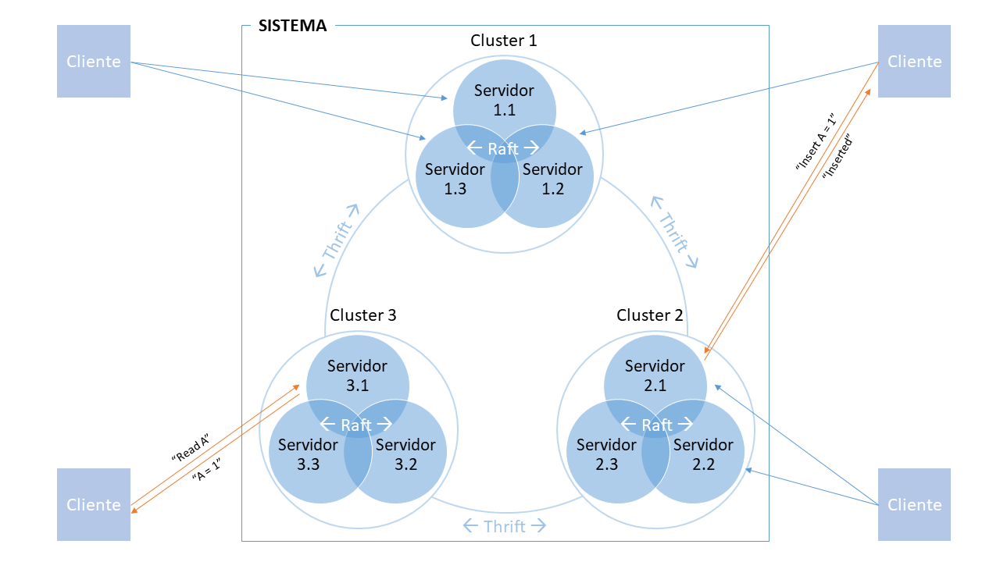

# Sistemas Distribuídos

Sistema de banco de dados distribuído, replicado e tolerante a falhas. A comunicação entre cada cliente e servidor utiliza Thrift, e a replicação entre os servidores utiliza Raft.

O modelo funciona como na imagem acima. N servidores são iniciados, e para cada servidor 2 outras réplicas são construídas. Cada nó possui 3 servidores e o cliente pode se comunicar com qualquer servidor de qualquer nó. Os servidores compartilham dados e serviços, portanto, todos podem atender a qualquer cliente.

## Autores

* Steffan Martins Alves - [LinkedIn](https://www.linkedin.com/in/steffanmartins/)
* Marcelo Alves Prado - [LinkedIn](https://www.linkedin.com/in/marcelo-prado-a07006118/)
* Rhaniel Cristhian - [LinkedIn](https://www.linkedin.com/in/rhaniel-cristhian-9b9b75a4/)
* Heitor Henrique Nunes - [LinkedIn](https://www.linkedin.com/in/heitor-nunes-7b1322176/)

## Licença

Este projeto está licenciado sob a MIT License - leia [LICENSE.md](LICENSE.md) para mais detalhes.
